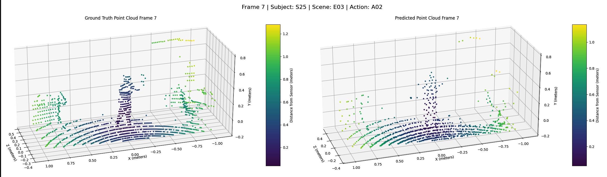
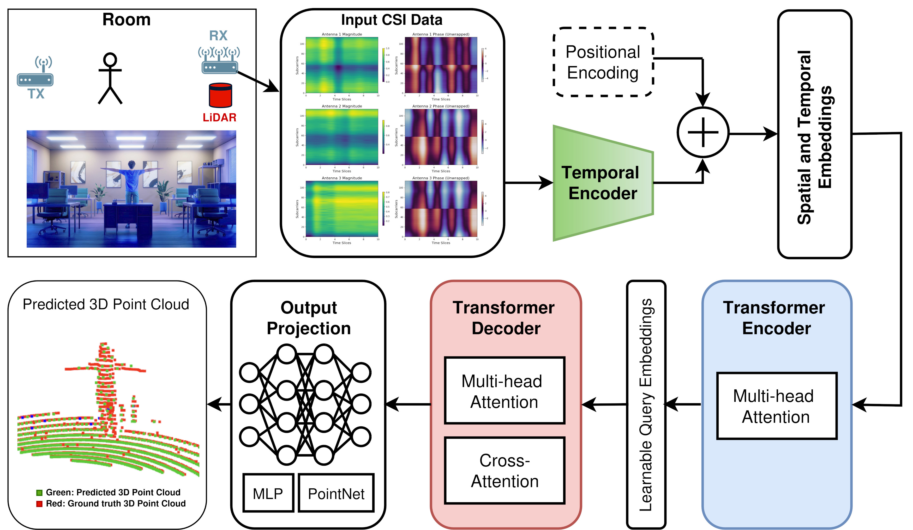

# CSI2PointCloud: Spatio-Temporal 3D Point Clouds from WiFi-CSI Data via Transformer Networks
[](https://opensource.org/licenses/MIT)
[](https://www.python.org/downloads/release/python-380/)

The repository contains the official implementation for the paper **"Spatio-Temporal 3D Point Clouds from WiFi-CSI Data via Transformer Networks"**.

[**[Paper]**](https://arxiv.org/abs/2410.16303) - Accepted in 5th IEEE International Symposium on Joint Communications & Sensing (JC&S 2025).

[**[Models]**](https://drive.google.com/drive/folders/1U9hMGtMoQWgP_Obi5k1Vts_WbEHi85Vi?usp=sharing) - Available checkpoints files for testing.


Authors: Tuomas Määttä, Sasan Sharifipour, Miguel Bordallo López, Constantino Álvarez Casado




This project aims to estimate 3D point clouds of indoor environments using non-contact sensing via WiFi Channel State Information (CSI)
data obtained through Multiple-Input Multiple-Output (MIMO) configurations. By leveraging a transformer-based architecture, 
the system processes temporal CSI data, including both amplitude and phase information, from multiple transmitters and receivers 
to generate accurate and detailed 3D reconstructions of indoor spaces.

The approach effectively captures the spatial and temporal dynamics of the environment, enabling modeling of human presence 
and movement within various indoor settings. The system is evaluated on the MM-Fi dataset [1], which comprises comprehensive CSI 
measurements reflecting human activities across diverse indoor environments.

This repository contains the implementation code for the paper titled “Spatio-Temporal 3D Point Clouds from WiFi-CSI Data via Transformer Networks” available on arXiv. 
You can access the full details and experimental results in the published work.


## Abstract
Joint communication and sensing (JC&S) is emerging as a key component in 5G and 6G networks, enabling dynamic adaptation 
to environmental changes and enhancing contextual awareness for optimized communication. By leveraging real-time environmental 
data, JC&S improves resource allocation, reduces latency, and enhances power efficiency, while also supporting simulations 
and predictive modeling. This makes it a key technology for reactive systems and digital twins. These systems can respond 
to environmental events in real-time, offering transformative potential in sectors like smart cities, healthcare, 
and Industry 5.0, where adaptive and multimodal interaction is critical to enhance real-time decision-making. 
In this work, we present a transformer-based architecture that processes temporal Channel State Information (CSI) data, 
specifically amplitude and phase, to generate 3D point clouds of indoor environments. The model utilizes a multi-head 
attention to capture complex spatio-temporal relationships in CSI data and is adaptable to different CSI configurations. 
We evaluate the architecture on the MM-Fi dataset, using two different protocols to capture human presence in indoor 
environments. The system demonstrates strong potential for accurate 3D reconstructions and effectively distinguishes 
between close and distant objects, advancing JC&S applications for spatial sensing in future wireless networks. 




## Installation
If you want to use our test and evaluation application, clone the repository and follow the instructions.

## Requirements
* Python 3.8+
* Linux and Windows
* See also requirements.txt and environment.yml files

Some Linux distributions may not include all of the tools required by the dependencies. If you see errors during the `pip3` installation, you might need to manually install additional packages as indicated in your distribution's package manager.

## Script for Installation
For the installation of the _requirements_ and _environment_, run the script:
* Run: `./install.sh`

If you are using Windows, use the _environment.yml_ file to install the dependencies.

> **Note:** The code is **not tested regularly on Windows**. It has been fully tested on Linux Ubuntu OS.

## TODO List
 - [X] Add CSI2PointCloud Model Architecture
 - [X] Add training scripts
 - [X] Add testing scripts (inference)
 - [ ] Evaluation of the model on additional datasets
 - [ ] Implementation of a user-friendly GUI for visualizing point cloud data
 - [ ] Improved data augmentation strategies to enhance model generalizability
 - [ ] Code refactoring and enhanced documentation for ease of use


##  Citation
```
@misc{määttä2024csi2pointcloud,
      title={Spatio-Temporal 3D Point Clouds from WiFi-CSI Data via Transformer Networks}, 
      author={Tuomas Määttä and Sasan Sharifipour and Miguel Bordallo López and Constantino Álvarez Casado},
      year={2024},
      eprint={2410.16303},
      archivePrefix={arXiv},
      primaryClass={eess.SP},
      url={https://arxiv.org/abs/2410.16303}, 
}
```

## Authors and Acknowledgment
This project is developed by the Multimodal Sensing Lab (MMSLab) team of the Center for Machine Vision and Signal Analysis (CMVS) 
at the University of Oulu.
* **Authors**: Tuomas Määttä, Sasan Sharifipour, Miguel Bordallo López, Constantino Álvarez Casado
* **Contact Information**: 
  * For general questions, contact the team leader: miguel.bordallo [at] oulu.fi
  * For code-related issues and technical questions, contact: constantino.alvarezcasado [at] oulu.fi

We acknowledge the contributions of everyone involved in this project and appreciate any further contributions or feedback from the community.

## License
This project is licensed under the MIT License - see the LICENSE.md file for details.

## References
[1] Yang, Jianfei, He Huang, Yunjiao Zhou, Xinyan Chen, Yuecong Xu, Shenghai Yuan, Han Zou, Chris Xiaoxuan Lu, and Lihua Xie. "Mm-fi: Multi-modal non-intrusive 4d human dataset for versatile wireless sensing." Advances in Neural Information Processing Systems 36 (2024).